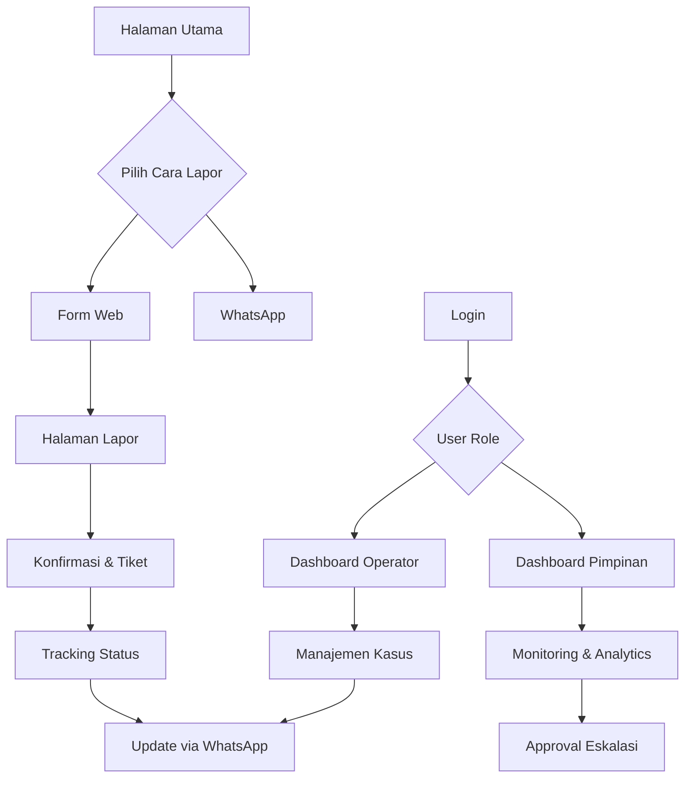

## 1. Product Overview
BELACALL adalah platform pelaporan dan manajemen kasus tingkat desa yang memungkinkan warga menyampaikan pengaduan, permohonan, aspirasi, maupun laporan kejadian secara mudah melalui WhatsApp maupun web.
Platform ini membantu perangkat desa melakukan triase, verifikasi, disposisi, tindak lanjut, dan pelaporan secara terukur, transparan, dan dapat diaudit hingga kasus dinyatakan selesai.

Target pengguna utama adalah warga desa, operator/perangkat desa, dan pimpinan desa untuk meningkatkan akuntabilitas dan transparansi pelayanan publik di tingkat desa.

## 2. User Persona & User Journey

### 2.1 User Persona

| Persona | Deskripsi & Latar Belakang | Goals (Tujuan) | Pain Points (Masalah) |
| :--- | :--- | :--- | :--- |
| **Pak Budi (Warga Desa)** | **Petani, 45 Tahun.** Menggunakan smartphone entry-level, kuota terbatas. Sangat familiar dengan WhatsApp, namun kurang nyaman dengan form web yang rumit. | • Melaporkan masalah desa (jalan rusak, sampah) dengan cepat. • Mengetahui apakah laporannya didengar dan ditindaklanjuti. • Tidak ingin ribet datang ke kantor desa. | • Bingung harus lapor ke siapa. • Malas jika harus isi formulir panjang. • Merasa laporannya sering diabaikan tanpa kabar. |
| **Mbak Siti (Operator Desa)** | **Staf Admin Desa, 28 Tahun.** Terbiasa menggunakan laptop dan smartphone. Bertanggung jawab mencatat administrasi dan melayani warga di kantor desa. | • Mengelola laporan warga dengan rapi dan terpusat. • Mudah memilah (triase) mana laporan valid dan hoax. • Memberikan respon cepat kepada warga tanpa mengetik manual berulang kali. | • Kewalahan dengan aduan via SMS/WA pribadi yang tercecer. • Kesulitan merekap data untuk laporan bulanan. • Sering lupa update status ke warga karena sibuk. |
| **Pak Lurah Joko (Kepala Desa)** | **Kepala Desa, 50 Tahun.** Mobilitas tinggi, sering dinas luar. Mengandalkan smartphone untuk komunikasi kerja. Mengutamakan data ringkas dan akurat. | • Memantau kinerja perangkat desa dalam menangani masalah. • Mendapatkan data statistik nyata untuk pengambilan keputusan. • Menjaga citra desa yang responsif dan transparan. | • Sulit memantau progress penanganan masalah secara real-time. • Laporan bawahan sering terlambat atau tidak akurat. • Tidak punya data historis masalah desa. |

### 2.2 User Journey Map (Realistic & Detailed)

#### A. Journey Pak Budi (Pelapor via WhatsApp) - *The Reality Check*
**Scenario**: Melaporkan jalan rusak, tapi data tidak lengkap & proses tidak mulus.

1.  **Initiation (Gagap Teknologi)**:
    *   *Happy Path*: Kirim "Lapor".
    *   *Reality*: Pak Budi bingung format, dia kirim foto doang tanpa caption.
    *   *System Response*: Bot mendeteksi image tanpa konteks, membalas: "Halo, untuk melapor silakan ketik 'LAPOR' terlebih dahulu."
    *   *Retry*: Pak Budi mengetik "Lapor jalan rusak".

2.  **Data Collection (Missing Info)**:
    *   *Bot Ask*: "Mohon kirimkan Foto Bukti & Share Location."
    *   *Reality*: Pak Budi kirim foto, tapi lupa lokasi. Sinyal susah untuk share loc.
    *   *Handling*: Bot mendeteksi lokasi belum ada. Bot memandu: "Bisa ketik nama jalan/dusunnya saja Pak jika susah share location?"
    *   *Completion*: Pak Budi mengetik "Dusun Suka Maju, depan warung Bu Tejo".

3.  **Verification (Human Loop)**:
    *   *Process*: Laporan masuk ke Mbak Siti. Status: "Menunggu Verifikasi".
    *   *Validation*: Mbak Siti cek foto. Ternyata fotonya gelap/blur.
    *   *Manual Feedback*: Mbak Siti klik tombol "Minta Foto Ulang" di dashboard.
    *   *User Action*: Pak Budi dapat WA: "Mohon maaf foto kurang jelas, bisa kirim ulang?" (Pak Budi harus kembali ke lokasi besoknya).

4.  **Waiting Game (The Bottleneck)**:
    *   *Expectation*: 2 hari selesai.
    *   *Reality*: 4 hari tidak ada kabar karena alat berat desa sedang dipakai di dusun lain.
    *   *User Anxiety*: Pak Budi cek status via WA "Cek status #T123".
    *   *System Reply*: "Status: Dalam Antrian Penanganan (Estimasi terlambat 2 hari karena antrian alat)." -> *Transparansi mengurangi kemarahan.*

#### B. Journey Mbak Siti (Operator/Admin) - *Handling Chaos*
**Scenario**: Mengelola laporan spam, koordinasi manual, dan tim lapangan yang gaptek.

1.  **Filtering Noise**:
    *   *Event*: Masuk 10 laporan baru. 3 di antaranya adalah iseng/spam dari anak-anak sekolah.
    *   *Action*: Mbak Siti mereject 3 laporan spam dengan alasan "Laporan Tidak Valid".
    *   *System*: WA otomatis ke pelapor: "Laporan Anda ditolak karena terindikasi tidak valid."

2.  **Bridging the Gap (Offline-Online)**:
    *   *Event*: Laporan Pak Budi (Jalan Rusak) valid. Mbak Siti assign ke "Pak Kadus A".
    *   *Reality*: Pak Kadus A jarang buka HP/Aplikasi.
    *   *Manual Intervention*: Sistem memberi alert ke Mbak Siti "Tiket #T123 belum di-acknowledge Pak Kadus > 24 jam".
    *   *Action*: Mbak Siti **telepon** Pak Kadus A secara manual. "Pak, ada laporan jalan, tolong dicek."
    *   *Proxy Update*: Pak Kadus kirim foto perbaikan lewat WA pribadi ke Mbak Siti (bukan upload ke sistem). **Mbak Siti yang menginput update & foto ke Dashboard** atas nama Pak Kadus.

3.  **Closing with Evidence**:
    *   *Action*: Setelah input bukti dari Pak Kadus, Mbak Siti set status "Selesai".
    *   *Verification*: Sistem meminta "Apakah warga sudah dikonfirmasi?". Mbak Siti centang "Ya", lalu submit.

#### C. Journey Pak Lurah Joko (Monitoring) - *Crisis Management*
**Scenario**: Menangani komplain yang viral/eskalasi.

1.  **Red Flag Alert**:
    *   *Event*: Ada laporan "Sampah Numpuk" yang sudah 7 hari statusnya masih "Diproses". Warga mulai ribut di grup WA desa.
    *   *System*: Dashboard Pimpinan memunculkan notifikasi "High Priority Alert: Tiket #T999 Overdue 3 days".

2.  **Intervention**:
    *   *Action*: Pak Lurah tidak hanya melihat grafik. Ia buka detail tiket, melihat history: "Kendala: Truk sampah mogok".
    *   *Decision*: Pak Lurah menggunakan fitur **"Instruction Note"** di dashboard: "Sewa pickup swasta hari ini juga, jangan tunggu truk bener. Dana taktis cairkan."

3.  **Accountability**:
    *   *Result*: Operator (Mbak Siti) melihat instruksi langsung Pak Lurah. Tindakan diambil segera.
    *   *Audit*: Di rapat senin, Pak Lurah buka data: "Bulan ini kita telat di 5 kasus sampah, tolong evaluasi maintenance truk." (Data bicara, bukan perasaan).

## 3. Core Features

### 3.1 User Roles

| Role | Registration Method | Core Permissions |
|------|---------------------|------------------|
| Warga Desa | Nomor WhatsApp + OTP | Membuat laporan, melacak status laporan, memberikan feedback |
| Operator Desa | Admin assignment | Mengelola kasus (triase, verifikasi, disposisi), update status (trigger notif otomatis), manajemen data |
| Pimpinan Desa | Admin assignment | Monitoring dashboard, approval, eskalasi kasus, akses laporan |

### 3.2 Feature Module

Platform BELACall terdiri dari halaman-halaman utama berikut:
1. **Halaman Utama**: informasi layanan, tombol lapor, panduan penggunaan
2. **Halaman Lapor**: form pengaduan, upload bukti, pilihan kategori
3. **Halaman Tracking**: lacak status laporan via nomor tiket/WhatsApp
4. **Dashboard Operator**: daftar kasus, manajemen kasus, update status
5. **Dashboard Pimpinan**: overview kasus, analytics, approval eskalasi
6. **Halaman Login**: autentikasi untuk operator dan pimpinan desa

### 3.3 Page Details

| Page Name | Module Name | Feature description |
|-----------|-------------|---------------------|
| Halaman Utama | Hero Section | Menampilkan tagline layanan, statistik kasus yang terselesaikan, tombol aksi utama "Lapor Sekarang" |
| Halaman Utama | Panduan Layanan | Penjelasan cara melapor via WhatsApp dan web, alur penanganan kasus, SLA layanan |
| Halaman Lapor | Form Pengaduan | Input detail laporan (judul, deskripsi, lokasi, kategori), validasi required fields |
| Halaman Lapor | Upload Bukti | Upload foto/video bukti max 5MB per file, preview sebelum submit |
| Halaman Lapor | Konfirmasi | Tampilkan nomor tiket, estimasi waktu penanganan, tombol share ke WhatsApp |
| Halaman Tracking | Cek Status | Input nomor tiket atau nomor WhatsApp untuk melacak status laporan |
| Halaman Tracking | Timeline Kasus | Tampilkan status kasus secara kronologis dengan timestamp dan keterangan |
| Dashboard Operator | Daftar Kasus | Filter dan sortir kasus by status, kategori, tanggal, assignee, search functionality |
| Dashboard Operator | Detail Kasus | View detail laporan, update status, tambahkan catatan internal, upload bukti tindak lanjut |
| Dashboard Operator | Log Aktivitas | Melihat riwayat notifikasi otomatis yang dikirim sistem ke WhatsApp pelapor |
| Dashboard Pimpinan | Overview Kasus | Statistik kasus by status, kategori, waktu penyelesaian, grafik trend |
| Dashboard Pimpinan | Manajemen Eskalasi | Review kasus yang perlu dieskalasi, approval, reassign ke tim tertentu |
| Halaman Login | Form Autentikasi | Login dengan email/username dan password, session management, remember me |

## 4. Core Process

### Flow Warga Desa (Pelapor)
1. Warga mengakses halaman utama BELACall
2. Memilih cara melapor: via WhatsApp (chat otomatis) atau form web
3. Mengisi detail laporan dan upload bukti jika ada
4. Menerima nomor tiket dan konfirmasi via WhatsApp
5. Menerima update status secara berkala via WhatsApp
6. Dapat mengecek status kapan saja via fitur tracking

### Flow Operator Desa
1. Login ke dashboard operator
2. Melihat daftar kasus masuk yang perlu ditriase
3. Melakukan triase awal: validasi, kategorisasi, assign ke petugas
4. Update status kasus sesuai progress (diproses, ditindaklanjuti, selesai)
5. Berkomunikasi dengan pelapor via WhatsApp untuk klarifikasi
6. Upload bukti tindak lanjut dan dokumentasi
7. Menutup kasus dengan laporan akhir

### Flow Pimpinan Desa
1. Login ke dashboard pimpinan
2. Monitoring overview kasus secara real-time
3. Review kasus yang perlu approval atau eskalasi
4. Melihat analytics dan laporan kinerja tim
5. Memberikan arahan untuk kasus tertentu

## 5. User Interface Design

### 5.1 Design Style
- **Primary Color**: Hijau desa (#2E7D32) - mencerminkan kepercayaan dan pertumbuhan
- **Secondary Color**: Biru tua (#1976D2) - profesionalisme pelayanan
- **Button Style**: Rounded corners dengan shadow subtle, hover effect
- **Font**: Inter untuk heading, Open Sans untuk body text
- **Layout**: Card-based design dengan white space yang optimal
- **Icon Style**: Material Design Icons dengan warna monokromatik

### 5.2 Page Design Overview

| Page Name | Module Name | UI Elements |
|-----------|-------------|-------------|
| Halaman Utama | Hero Section | Full-width banner dengan gradient overlay, headline besar "Laporkan Masalah Desa dengan Mudah", CTA button hijau prominent |
| Halaman Lapor | Form Section | Card putih dengan border radius 8px, input fields dengan label di atas, progress indicator 3 langkah |
| Dashboard Operator | Data Table | Tabel dengan zebra striping, status badge dengan warna beda (merah=baru, kuning=diproses, hijau=selesai), action buttons icon |
| Dashboard Pimpinan | Analytics | Chart.js untuk grafik, card statistik dengan icon besar, filter dropdown compact |
| Halaman Tracking | Timeline | Vertical timeline dengan icon status, warna line sesuai progress, timestamp di samping kiri |

### 5.3 Responsiveness
Desktop-first design dengan breakpoint:
- Desktop: 1200px ke atas (layout 3 kolom untuk dashboard)
- Tablet: 768px - 1199px (layout 2 kolom, menu hamburger)
- Mobile: < 768px (single column, touch-friendly buttons min 44px)

Touch interaction optimization untuk mobile dengan:
- Swipe gesture untuk navigasi timeline
- Pull-to-refresh untuk update data
- Touch feedback yang jelas
- Form input dengan keyboard appropriate
