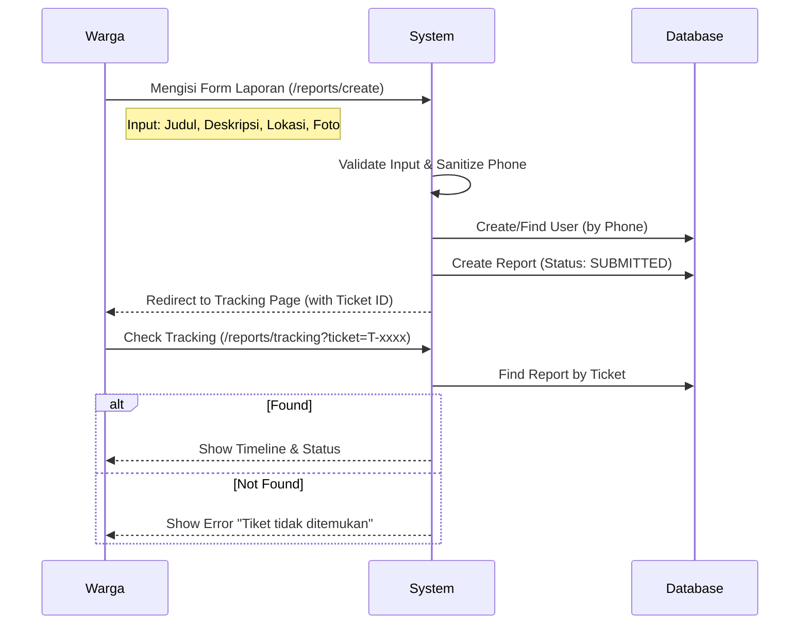
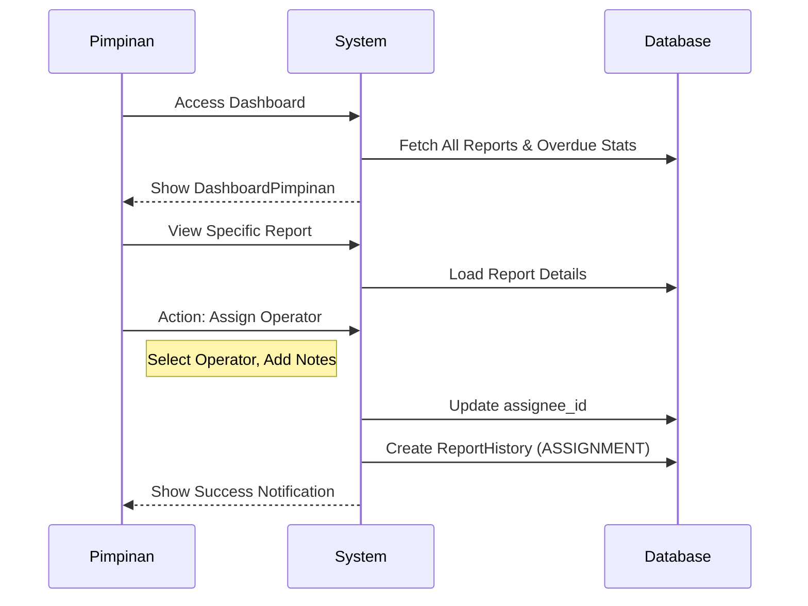
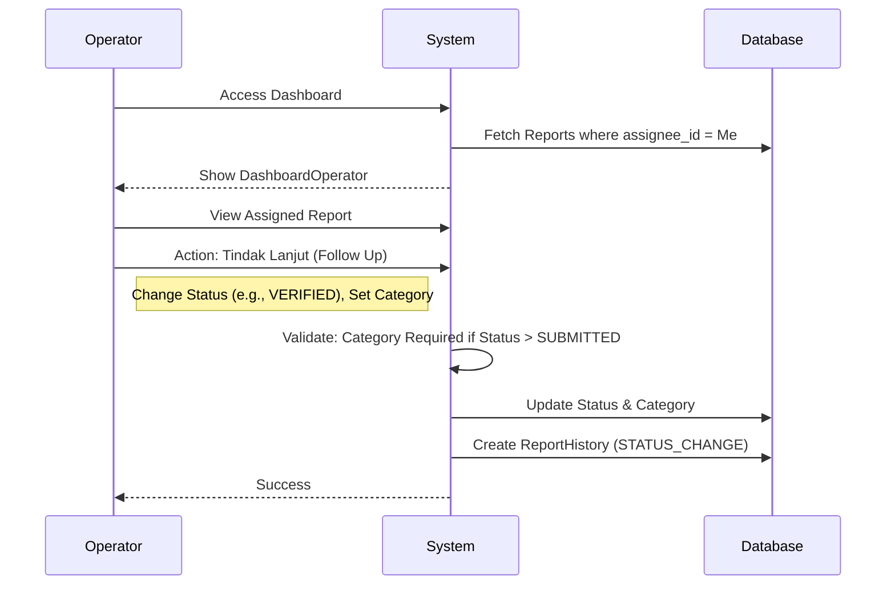

# Panduan Pengujian End-to-End (E2E) Sistem Pelaporan Warga

Dokumen ini mencakup alur pengujian komprehensif untuk sistem pelaporan warga, mencakup analisis arsitektur, skenario pengguna (Warga, Pimpinan, Operator), dan penanganan edge case.

## 1. Analisis Arsitektur & Preconditions

### Struktur Entitas Utama
*   **Report**: Entitas utama (Laporan). Memiliki `ticket_number` unik, `status` (Enum), dan `category` (Enum).
*   **User**: Aktor sistem dengan `Role` (WARGA, PIMPINAN, OPERATOR, ADMIN).
*   **ReportHistory**: Audit trail untuk setiap perubahan status dan penugasan.
*   **ReportEvidence**: Bukti foto/dokumen pendukung.

### Status Flow (Happy Path)
`SUBMITTED` -> `VERIFIED` -> `IN_PROGRESS` -> `RESOLVED` -> `CLOSED`

### Edge Flow
*   `SUBMITTED` -> `NEEDS_REVISION` -> `SUBMITTED` (Revisi Warga)
*   `SUBMITTED` -> `REJECTED`

### Roles & Permissions Matrix
| Role | Create | View | Assign Operator | Follow Up (Status Change) |
| :--- | :--- | :--- | :--- | :--- |
| **Warga** | Yes (Public) | Own Ticket Only | No | No (Only Revision) |
| **Pimpinan** | No | All Reports | **Yes** | No |
| **Operator** | No | **Assigned Only** | No | **Yes** (Assigned Only) |
| **Admin** | Yes | All Reports | Yes | Yes |

---

## 2. Skenario Pengujian Warga (Citizen)

### Sequence Diagram: Pelaporan & Tracking


### Test Cases

| ID | Skenario | Langkah Pengujian | Input Data | Expected Result | Actual Code Ref |
| :--- | :--- | :--- | :--- | :--- | :--- |
| **TC-W1** | **Pelaporan Normal** | 1. Buka halaman buat laporan<br>2. Isi semua field valid<br>3. Submit | Phone: `08123456789`<br>Img: `valid.jpg` | - User dibuat/ditemukan<br>- Report created (SUBMITTED)<br>- Redirect ke Tracking<br>- **WA Notifikasi Diterima** | `WebReportController@store` |
| **TC-W2** | **Format Nomor HP** | 1. Isi nomor HP dengan simbol | Phone: `+62-812-345` | - Disimpan sebagai `62812345`<br>- User tidak duplikat | `WebReportController@store` (preg_replace) |
| **TC-W3** | **Revisi Laporan** | 1. Buka tracking tiket status `NEEDS_REVISION`<br>2. Klik "Kirim Revisi"<br>3. Update data | Status: `NEEDS_REVISION` | - Status berubah ke `SUBMITTED`<br>- History tercatat | `WebReportController@submitRevision` |

### Edge Cases (Warga)

1.  **EC-W1: Upload File Non-Gambar**
    *   *Action*: Upload file `.pdf` atau `.exe` pada field bukti.
    *   *Expected*: Validasi error "The evidence field must be an image".
    *   *Logic*: `StoreWebReportRequest` rules: `['evidence' => 'image|max:5120']`.

2.  **EC-W2: Akses Revisi pada Status Salah**
    *   *Action*: Warga mencoba POST ke endpoint revisi untuk tiket yang statusnya `IN_PROGRESS`.
    *   *Expected*: Redirect dengan error "Laporan ini belum membutuhkan perbaikan."
    *   *Logic*: `WebReportController@submitRevision` checks `if ($report->status !== ReportStatus::NEEDS_REVISION)`.

3.  **EC-W3: Tiket Tidak Valid**
    *   *Action*: Akses `/reports/tracking?ticket=INVALID-123`.
    *   *Expected*: Halaman tracking kosong / pesan "Tiket tidak ditemukan".

---

## 3. Skenario Pengujian Pimpinan (Leadership)

### Sequence Diagram: Monitoring & Assignment


### Test Cases

| ID | Skenario | Langkah Pengujian | Input Data | Expected Result | Actual Code Ref |
| :--- | :--- | :--- | :--- | :--- | :--- |
| **TC-P1** | **Dashboard Overview** | 1. Login sebagai Pimpinan<br>2. Cek widget statistik | - | - Menampilkan total laporan, overdue, dll<br>- Data sesuai DB | `DashboardPimpinan.php` |
| **TC-P2** | **Assign Operator** | 1. Buka detail laporan<br>2. Klik "Assign Operator"<br>3. Pilih Operator | Operator: `Op1` | - `assignee_id` terupdate<br>- History: "Penugasan" | `ViewReport.php` (Action: assignOperator) |

### Edge Cases (Pimpinan)

1.  **EC-P1: Mencoba Mengubah Status (Follow Up)**
    *   *Action*: Pimpinan mencari tombol "Tindak Lanjut" di halaman detail.
    *   *Expected*: Tombol **TIDAK MUNCUL**.
    *   *Logic*: `ReportPolicy@followUp` return `false` untuk role PIMPINAN (kecuali user tersebut juga Admin).
    
2.  **EC-P2: Assign pada Laporan Closed**
    *   *Action*: Pimpinan mencoba assign operator pada laporan yang statusnya `CLOSED`.
    *   *Expected*: Action mungkin masih muncul (UI tidak memblokir eksplisit berdasarkan status, hanya permission), tapi secara bisnis harus divalidasi.
    *   *Recommendation*: Tambahkan `visible(fn ($record) => !in_array($record->status, [RESOLVED, CLOSED]))` pada `assignOperator` action di `ViewReport.php`.

---

## 4. Skenario Pengujian Operator

### Sequence Diagram: Tindak Lanjut (Follow Up)


### Test Cases

| ID | Skenario | Langkah Pengujian | Input Data | Expected Result | Actual Code Ref |
| :--- | :--- | :--- | :--- | :--- | :--- |
| **TC-O1** | **View Assigned Reports** | 1. Login Operator<br>2. Cek list laporan | - | - Hanya melihat laporan yang di-assign ke dirinya | `ReportResource::getEloquentQuery` |
| **TC-O2** | **Verifikasi Laporan** | 1. Buka laporan `SUBMITTED`<br>2. Tindak Lanjut -> `VERIFIED` | Kat: `Infrastruktur` | - Status update<br>- Kategori tersimpan | `ViewReport.php` (Action: followUp) |

### Edge Cases (Operator)

1.  **EC-O1: Akses Laporan Orang Lain**
    *   *Action*: Operator copy-paste URL laporan yang di-assign ke operator lain (`/admin/reports/999`).
    *   *Expected*: 403 Forbidden / 404 Not Found.
    *   *Logic*: `ReportResource::getEloquentQuery` memfilter global `where('assignee_id', $user->id)` untuk Operator.

2.  **EC-O2: Update Status Tanpa Kategori**
    *   *Action*: Operator mengubah status ke `IN_PROGRESS` tanpa memilih kategori.
    *   *Expected*: Validasi Gagal "The category field is required."
    *   *Logic*: `ViewReport::requiresCategoryForStatus` me-return `true` untuk status `VERIFIED` ke atas.

3.  **EC-O3: Operator Assign Diri Sendiri?**
    *   *Action*: Operator mencari tombol "Assign Operator".
    *   *Expected*: Tombol tidak muncul.
    *   *Logic*: `ReportPolicy@assign` return `false` untuk Operator.

---

## 5. Summary & Recommendations

### Critical Path Testing
1.  **Warga Submit** -> **Pimpinan Assign** -> **Operator Verify** -> **Operator Resolve**.
2.  **Warga Submit** -> **Operator Reject** (jika spam).
3.  **Warga Submit** -> **Operator Needs Revision** -> **Warga Revise** -> **Operator Verify**.

### Potential Improvements (Based on Analysis)
1.  **Notifikasi WhatsApp ke Warga (Status Update)**
    *   *Issue*: Saat ini notifikasi WhatsApp hanya dikirim **SEKALI** saat laporan dibuat (`WebReportController@store`). Tidak ada notifikasi saat status berubah (misal: "Laporan Anda sedang diproses" atau "Laporan Selesai"). Warga harus cek manual via tracking link.
    *   *Recommendation*: Integrasikan `FonnteService` ke dalam Action `followUp` di `ViewReport.php` dan Observer `ReportObserver`. Kirim pesan otomatis setiap status berubah, terutama untuk status penting: `VERIFIED`, `IN_PROGRESS`, `RESOLVED`, `NEEDS_REVISION`.
    *   *Logic*:
        ```php
        // Contoh Pseudo-code di dalam Action/Observer
        if ($oldStatus !== $newStatus) {
            $msg = "Status tiket {$report->ticket_number} berubah menjadi: " . ReportStatus::from($newStatus)->label();
            $fonnteService->sendText($report->user->phone, $msg);
        }
        ```

### Implemented Improvements
1.  **Validasi Status saat Assignment (Pimpinan)**
    *   *Status*: **SUDAH DIKERJAKAN**. Logic status check sudah ada di `ReportPolicy@assign`.
2.  **Bulk Assignment (Penugasan Massal)**
    *   *Status*: **SUDAH DIKERJAKAN**. `BulkAction` sudah ada di `Reports.php`.
3.  **Visualisasi Beban Kerja Operator**
    *   *Status*: **SUDAH DIKERJAKAN**. Dropdown menampilkan count task (`operatorOptionsWithLoad`).
4.  **Notifikasi Penugasan**
    *   *Status*: **SUDAH DIKERJAKAN**. `ReportAssigned` notification terkirim.
5.  **Pencegahan Re-Assignment pada Laporan Final**
    *   *Status*: **SUDAH DIKERJAKAN**. Tercover di `ReportPolicy`.
